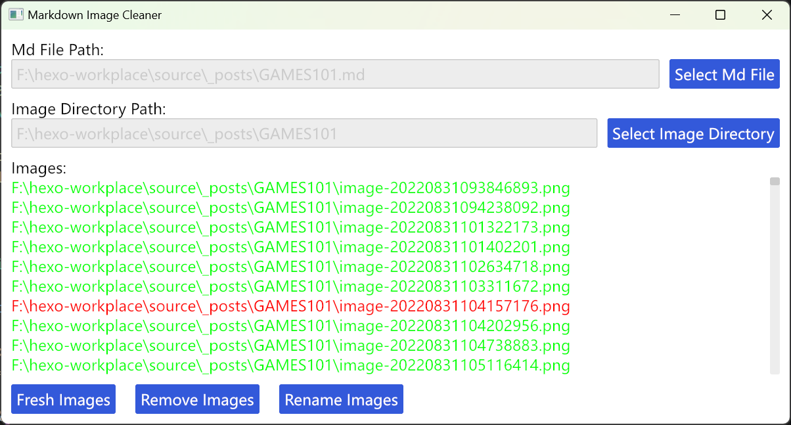

# rm-unused-img

this is a tool to remove unused images from your markdown image directory.

it is useful when you use Editor like Typora and set auto copy image to a directory.

## Usage

1. select the markdown file you want to check.
2. it will auto check asset directory of the markdown file. if markdown file is `./${filename}.md`, it will check
   - `./${filename}`
   - `./${filename}.assets`
3. if auto check failed, or you want to check other directory, you can input the directory manually.
4. then the images in the directory will be listed. green is used, red is unused.
4. click remove button to remove unused images.

## Preview

